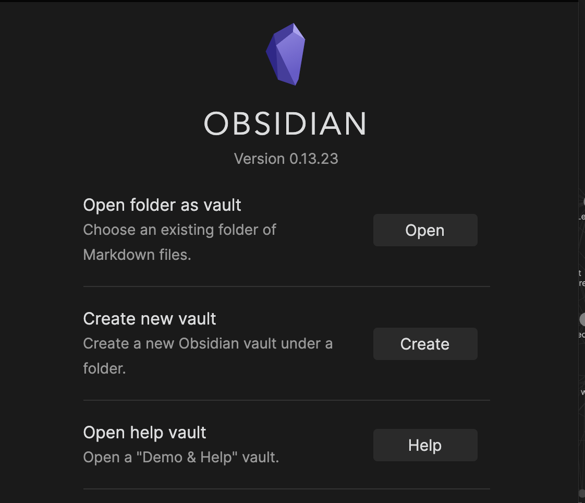
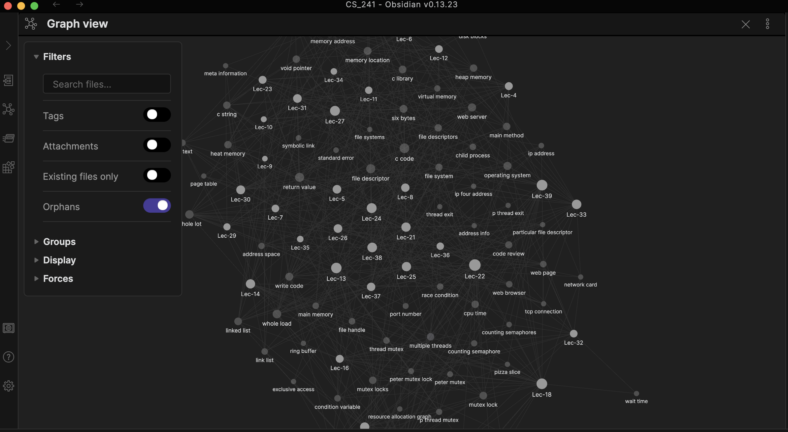
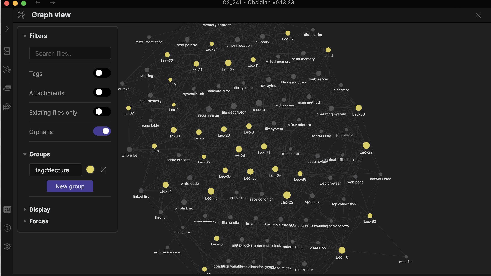

# Open folder as vault

# Open graph view

Click the network-like icon from left side bar. And you should be able to see this.

# Customize graph view

From graph view, choose Groups -> New group. Enter query: tag:#lecture. And you can change the color.

